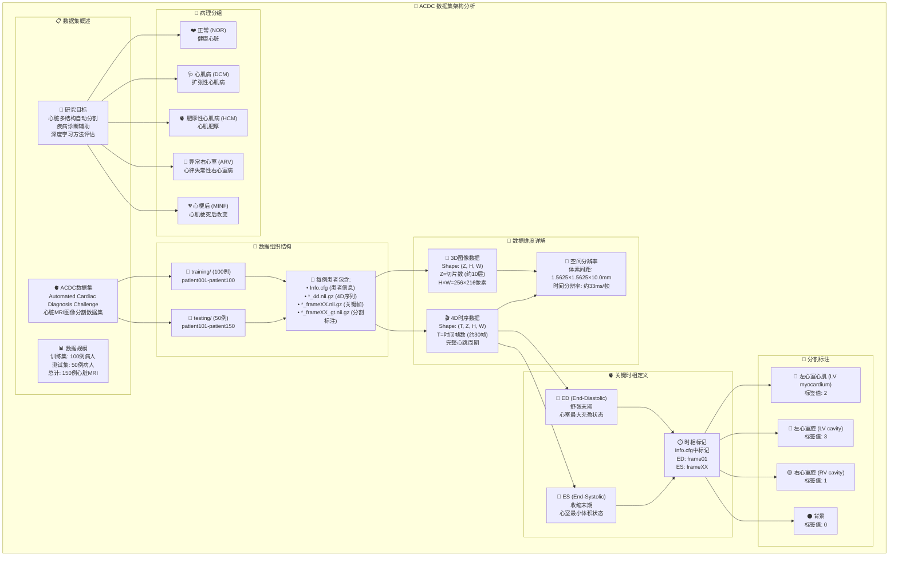

# ACDC 数据集分析

## 📋 数据集概述

**ACDC** (Automated Cardiac Diagnosis Challenge) 是一个专门用于心脏MRI图像分割和疾病诊断的医学影像数据集。该数据集来自IEEE Transactions on Medical Imaging 2018年的经典论文。

## 🏗️ 数据集架构图



## 📊 数据详细分析

### 🗂️ 文件结构说明

每个患者文件夹包含以下文件：

| 文件类型 | 文件名格式 | 说明 |
|---------|-----------|------|
| **患者信息** | `Info.cfg` | 包含患者基本信息和关键时相标记 |
| **4D时序数据** | `patient###_4d.nii.gz` | 完整心跳周期的4D MRI数据 |
| **关键帧图像** | `patient###_frame##.nii.gz` | ED和ES时相的3D图像 |
| **分割标注** | `patient###_frame##_gt.nii.gz` | 对应关键帧的分割Ground Truth |

### 📐 数据维度详解

#### 🔢 3D数据格式
```python
# 单帧3D图像
img.shape = (Z, H, W)  # 例如: (10, 256, 216)
img.dtype = int16      # 16位整型
voxel_spacing = (1.5625, 1.5625, 10.0)  # mm
```

#### 🎬 4D数据格式  
```python
# 4D时序数据
seq.shape = (T, Z, H, W)  # 例如: (30, 10, 256, 216)
seq.dtype = int16         # 16位整型
voxel_spacing = (1.5625, 1.5625, 10.0, 1.0)  # mm + 时间
```

### 🫀 心脏解剖结构标注

ACDC数据集专注于心脏的三个主要结构：

| 结构名称 | 标签值 | 颜色标识 | 临床意义 |
|---------|-------|---------|----------|
| **右心室腔** (RV) | 1 | 🟡 黄色 | 向肺部泵血的心室 |
| **左心室心肌** (LV myocardium) | 2 | 🔴 红色 | 心脏的主要肌肉组织 |
| **左心室腔** (LV cavity) | 3 | 🔵 蓝色 | 向全身泵血的心室 |
| **背景** | 0 | ⚫ 黑色 | 非心脏组织 |

### ⏱️ 心脏时相分析

#### 💓 关键时相定义
- **ED (End-Diastolic)**: 舒张末期，心室最大充盈状态
- **ES (End-Systolic)**: 收缩末期，心室最小体积状态

#### 📊 患者101示例分析
```
Info.cfg内容:
- ED: 1 (frame01)     # 舒张末期在第1帧
- ES: 14 (frame14)    # 收缩末期在第14帧  
- Group: DCM          # 疾病类型：扩张性心肌病
- Height: 169.0 cm    # 身高
- Weight: 79.0 kg     # 体重
- NbFrame: 30         # 总帧数
```

### 🏥 疾病分类

ACDC数据集包含5种心脏疾病类型：

| 疾病类型 | 英文缩写 | 特征描述 | 临床意义 |
|---------|---------|---------|----------|
| **正常** | NOR | 健康心脏，功能正常 | 对照组，用于比较 |
| **扩张性心肌病** | DCM | 心室扩大，收缩功能减弱 | 常见心力衰竭原因 |
| **肥厚性心肌病** | HCM | 心肌异常增厚 | 遗传性心脏病 |
| **异常右心室** | ARV | 右心室结构异常 | 心律失常风险高 |
| **心梗后改变** | MINF | 心肌梗死后瘢痕形成 | 影响心脏功能 |

## 🔬 数据应用方法

### 📈 研究应用

1. **🎯 图像分割**：
   - 心脏结构自动分割
   - U-Net、nnU-Net等深度学习方法
   - 多类别分割任务

2. **🏥 疾病诊断**：
   - 基于影像的自动诊断
   - 心功能参数计算
   - 疾病分类任务

3. **⏰ 时序分析**：
   - 心脏运动分析
   - 功能评估
   - 4D时空建模

### 💻 使用script_acdc_visu.ipynb

可视化脚本提供了以下功能：

```python
# 1. 加载3D单帧数据
img, info = sitk_load("patient###_frame##.nii.gz")
print(f"Shape: {img.shape}")  # (Z, H, W)

# 2. 加载4D时序数据  
seq, info = sitk_load("patient###_4d.nii.gz")
print(f"Shape: {seq.shape}")  # (T, Z, H, W)

# 3. 创建心跳动画
anim = FuncAnimation(fig, animate, frames=num_frames)
HTML(anim.to_jshtml())  # 在Jupyter中显示动画
```

### 🛠️ 最佳实践

1. **数据预处理**：
   - 强度归一化
   - 重采样到统一分辨率
   - 数据增强

2. **评估指标**：
   - Dice系数
   - Hausdorff距离
   - 临床参数准确性

3. **基准方法**：
   - nnU-Net (当前最佳方法)
   - ASCENT项目实现
   - 传统图像处理方法对比

## 📝 引用信息

**必须引用**：
```bibtex
@article{bernard2018deep,
  title={Deep Learning Techniques for Automatic MRI Cardiac Multi-structures Segmentation and Diagnosis: Is the Problem Solved?},
  author={Bernard, O. and Lalande, A. and Zotti, C. and Cervenansky, F. and others},
  journal={IEEE Transactions on Medical Imaging},
  volume={37},
  number={11},
  pages={2514--2525},
  year={2018},
  doi={10.1109/TMI.2018.2837502}
}
```

**许可证**：CC BY-NC-SA 4.0 (仅限非商业科研用途)

---

*ACDC数据集是心脏图像分割领域的重要基准数据集，为深度学习在医学影像中的应用提供了标准化的评估平台。*
