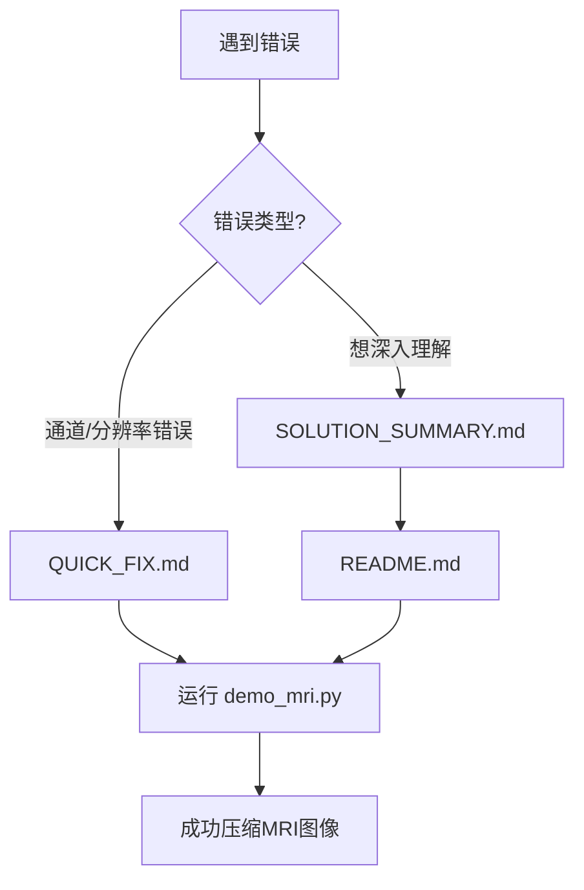

# 📚 医学图像压缩文档索引

## 🎯 快速导航

### 遇到错误?
- **错误: 4通道问题** → 查看 [QUICK_FIX.md](QUICK_FIX.md)
- **错误: 分辨率问题** → 查看 [SOLUTION_SUMMARY.md](SOLUTION_SUMMARY.md)
- **完整理解** → 查看 [README.md](README.md)

### 想要使用?
- **运行脚本**: `/root/Documents/ICLR-Med/1d-tokenizer/demo_mri.py`
- **数据加载**: `/root/Documents/ICLR-Med/MedCompression/dataloader/`

---

## 📖 文档列表

### 1. QUICK_FIX.md - 快速修复指南
**用途**: 快速解决报错
**内容**:
- 问题1: 通道数不匹配 (RGBA vs RGB)
- 问题2: 分辨率不匹配 (2370×1950 vs 256×256)
- 3行代码快速修复
- 问题根源计算说明

**适合**: 遇到错误需要立即解决

---

### 2. SOLUTION_SUMMARY.md - 完整解决方案
**用途**: 理解问题全貌和解决方案
**内容**:
- 两个错误的完整分析
- TiTok vs MRI的差异对比
- 数据转换流程图
- 性能分析和最佳实践
- 压缩效果预期

**适合**: 深入理解整个问题和解决过程

---

### 3. README.md - 详细技术文档
**用途**: 全面了解MRI图像压缩
**内容**:
- 问题详细分析
- 3种解决方案对比
- 完整MRI压缩工作流程
- 形状分析和计算
- 性能对比表格
- 代码示例

**适合**: 技术研究和深度学习

---

## 🚀 使用流程



## 📂 文件位置

```
/root/Documents/ICLR-Med/
├── MedCompression/
│   ├── docs/
│   │   ├── INDEX.md              # 本文档
│   │   ├── QUICK_FIX.md          # 快速修复
│   │   ├── SOLUTION_SUMMARY.md   # 完整方案
│   │   └── README.md             # 详细文档
│   └── dataloader/
│       ├── README_CN.md          # 数据加载器文档
│       └── acdc_dataset.py       # ACDC数据集
└── 1d-tokenizer/
    ├── demo_mri.py               # 修复后的脚本 ⭐
    └── demo.py                   # 原始脚本
```

## 🎯 常见问题快速查找

| 问题 | 查看文档 | 章节 |
|------|----------|------|
| **RuntimeError: 4 channels** | QUICK_FIX.md | 问题1 |
| **RuntimeError: tensor size** | QUICK_FIX.md | 问题2 |
| **如何修复?** | QUICK_FIX.md | 快速修复代码 |
| **为什么会这样?** | SOLUTION_SUMMARY.md | 根本原因 |
| **压缩率多少?** | SOLUTION_SUMMARY.md | 性能分析 |
| **最佳实践?** | README.md | 推荐工作流程 |
| **直接处理MRI数据?** | README.md | 方案3 |

## 💡 推荐阅读顺序

### 新手用户
1. QUICK_FIX.md (5分钟)
2. 运行 demo_mri.py
3. 查看输出结果

### 研究人员
1. SOLUTION_SUMMARY.md (10分钟)
2. README.md (20分钟)
3. 查看源代码 demo_mri.py

### 开发者
1. 阅读所有文档
2. 理解数据流程
3. 根据需求定制代码

---

**创建时间**: 2025-10-18
**版本**: v1.0
**维护**: 自动更新
